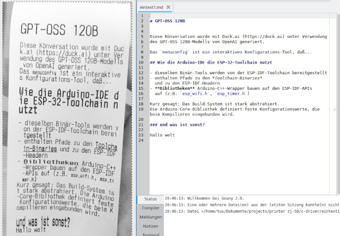

# EscPos_print

EscPos_print is an easy and simple tool for a direct access to a ESC/POS
58mm thermo printer on e.g. `/dev/usb/lp0`.

The tool prints 3 kinds of documents:

- png (scaled to max width)
- bmp (256 gray values, scaled to max width)
- md text UTF-8 files (Markdown)

For *Markdown* and UTF-8 the default `iconv.h` is used to convert it to CP858.
It is tested the german special chars.

For *png* Images the libpng library is used.



The **Atkinson dithering** is used for pictures.

## The limitted Markdown features

### Text

- UTF-8 text without BOM and `LF`
- a single newline is joined by a space
- 2 newlines caused into a line break
- 3 newlines caused into a new paragraph
- 2 or 3 spaces are shriked into a single one

### Headlines

Three versions of headlines via `#`, `##` and `###` are supported.

- a newline before and space behind the last `#` is needed
- the headline ends with 2 newlines

### Unordered Lists

Only an unordered list with the deep 1 is supported.

- starts with `-` and a single space
- a list ends with 2 newlines

### Font

A text (without newline) which is between these characters...

- grave accent: a bit smaller font `(condensed)`
- two asterisks: **bold**
- one asterisk: *underline and a bit bold*

### Not Supported

- Ordered Lists
- Blockquote or code blocks (a *to do*?)
- Link
- Image (a *to do* for png?)
- more then list deep 1 or othe kinds of headline formats
- horizontal rule (a *to do*?)

## Compile

```
cmake -B build
cmake --build build
```

## Usage

```
cd build
./escposPrint ./escposPrint <bmp png or md file> <device>
```

It is possible, the you have to add yourself to the `device` (?) group first,
to get access to the printer device.

### Limited

The format support and maybe the font sizes varry on each device. I am
sorry about that. A 100% support is not guaranteed.

## License

This is free and unencumbered software released into the public domain.

Anyone is free to copy, modify, publish, use, compile, sell, or
distribute this software, either in source code form or as a compiled
binary, for any purpose, commercial or non-commercial, and by any
means.

In jurisdictions that recognize copyright laws, the author or authors
of this software dedicate any and all copyright interest in the
software to the public domain. We make this dedication for the benefit
of the public at large and to the detriment of our heirs and
successors. We intend this dedication to be an overt act of
relinquishment in perpetuity of all present and future rights to this
software under copyright law.

THE SOFTWARE IS PROVIDED "AS IS", WITHOUT WARRANTY OF ANY KIND,
EXPRESS OR IMPLIED, INCLUDING BUT NOT LIMITED TO THE WARRANTIES OF
MERCHANTABILITY, FITNESS FOR A PARTICULAR PURPOSE AND NONINFRINGEMENT.
IN NO EVENT SHALL THE AUTHORS BE LIABLE FOR ANY CLAIM, DAMAGES OR
OTHER LIABILITY, WHETHER IN AN ACTION OF CONTRACT, TORT OR OTHERWISE,
ARISING FROM, OUT OF OR IN CONNECTION WITH THE SOFTWARE OR THE USE OR
OTHER DEALINGS IN THE SOFTWARE.

For more information, please refer to [unlicense.org](https://unlicense.org/)
